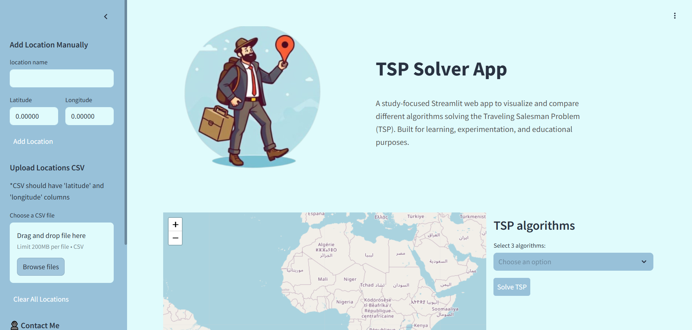
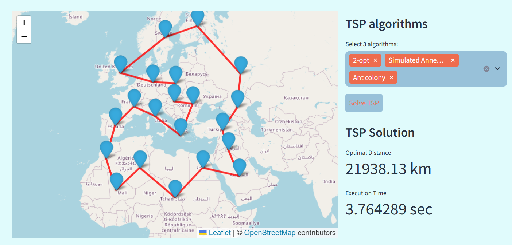
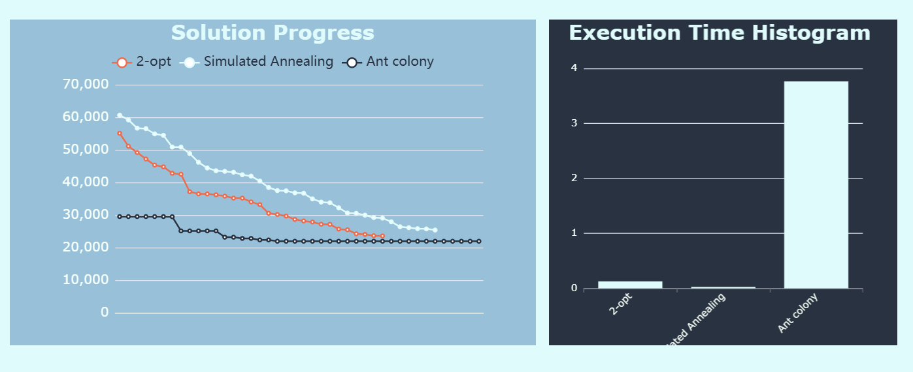

# tsp-streamlit-dashboard

A Streamlit-based web application that allows users to solve and compare different algorithms for the Traveling Salesman Problem (TSP). This project visualizes the optimization progress of each algorithm, provides interactive control over the input data (locations), and presents the results with styled charts and tables.

You can:
- Upload a `.xlsx` file with coordinates  
- Or select points manually on the map  
- Choose the TSP algorithms you want to compare  
- Run the solvers and view side-by-side results in an interactive dashboard

🔴 **[Live Demo](https://bellaouali-tsp-app-dashboard.streamlit.app)** 
💻 **[GitHub Repo](https://github.com/Bellaouali-anas/tsp-streamlit-dashboard.git)** 

## 📷 Screenshots

<div align="center">
  
  
  
</div>


## ✨ Features
📍 Add locations manually or via geolocation

📊 Compare multiple algorithms (e.g., Nearest Neighbor, 2-opt, Simulated Annealing)

📈 Interactive ECharts visualization of optimization progress

🧮 Styled DataFrame for final result comparison (distance, time, etc.)

🧹 Remove and manage locations dynamically

🎨 Custom styling for UI elements and charts and interactive map


## 📦 Technologies Used

- **Python**
- **Streamlit**
- **pyecharts** (via `streamlit-echarts`)
- **Pandas**
- **NumPy**


## 🚀 How to Run Locally
If you want to run this app on your computer:

1. Ensure you have **Python 3.7 or higher** installed.
2. Clone the repository:
   ```bash
   git clone https://github.com/anasbellaouali/tsp-streamlit-dashboard.git
   cd tsp-streamlit-dashboard
   ```
  

3. Install the dependencies:
    ```bash
    pip install -r requirements.txt
    ```


4. Run the app using Streamlit:
    ```bash
    streamlit run app.py
    ```

5. The app will open in your default web browser at **http://localhost:8501**


## 🤝 Contributions & Feedback
Feel free to fork the project, submit issues, or make pull requests to improve the app.
If you have feedback or feature requests, don't hesitate to open an issue or contact me directly.

## 📬 Contact
ANAS BELLAOUALI
📧 bellaoualai.anas@gmail.com
🔗 www.linkedin.com/in/anas-bellaouali

